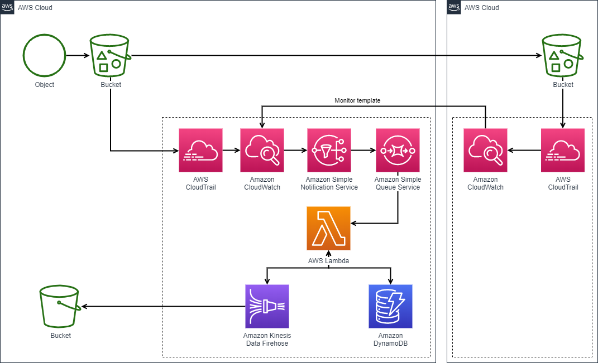

MarkdwonをDocxへ変換する
========================================================

本リポジトリは(Qiita記事)[https://qiita.com/Takenori-Kusaka/items/885321d0575ddc99cb83]用です。

## はじめに

本記事は表題を実現する一例です。
より良い方法や実現できないパターンがあることはご承知おきください。
typoなど凡ミスもご容赦いただけるとありがたいです。

## 背景

筆者も世のサラリーマンしがらみによってWord形式の納品/提供が求められました。
しかしどーーーーーーしてもWord管理はしたくない。
しかもソースコード管理上すでに良いMarkdownファイルがあるにも関わらず変換しなければならない。
こんな作業は**[ブルシットジョブ](https://honz.jp/articles/-/45761)だ！クソだ！**と叫びたくなったので何とかする方法を調べました。

## TL;DR

* [pandoc](https://pandoc.org/)は使いません(注1)
* 簡単なMarkdownであればそれなりにできた
* 工程が多くて手間
* 自動化できそうにない
* [mermaid](https://mermaid-js.github.io/mermaid/#/)や[PlantUML](https://plantuml.com/ja/)など特殊な表現には別途工夫が必要そう

注1: [pandoc](https://pandoc.org/)の変換は読み込めるファイルを作れるものの表が崩れるなど手直しの良いファイルしか生成できませんでした

## 本方法でできること/できないこと

### できること

* 比較的シンプルなMarkdownの変換
* 比較的元の情報を維持した変換

### できないこと

* jsなどのプログラム処理によるレンダリング部分  
  例えばmermaidなど。画像ファイル化して貼り付けてあればOK
* 可逆変換。本方法では非可逆に変換します。そのため、Wordに直接手直しされると反映が面倒です。
* cssの維持。htmlをWordで読み込むまでは良いが、最後docxとして保存するとその情報が破棄されます。markdownの書き方によっては体裁が崩れるかもしれません。

## 全体の流れ

1. [VisualStudioCode](https://azure.microsoft.com/ja-jp/products/visual-studio-code/)でMarkdownを作成する
2. [VisualStudioCode](https://azure.microsoft.com/ja-jp/products/visual-studio-code/)の拡張[Markdown Preview Enhanced](https://shd101wyy.github.io/markdown-preview-enhanced/#/)で確認する
3. [Markdown Preview Enhanced](https://shd101wyy.github.io/markdown-preview-enhanced/#/)の機能でHTML出力する
4. 出力したHTMLを[Google Chrome](https://www.google.com/intl/ja_jp/chrome/)で開く
5. ページを"完全な保存"する
6. [Optional]保存した_filesフォルダ内の画像を適当な幅にリサイズする
7. 保存したhtmlファイルをWordで開く

## 開発環境

* [Google Chrome](https://www.google.com/intl/ja_jp/chrome/)
* [VisualStudioCode](https://azure.microsoft.com/ja-jp/products/visual-studio-code/)
* [Markdown Preview Enhanced](https://shd101wyy.github.io/markdown-preview-enhanced/#/)
* [Optional][Python](https://docs.python.org/ja/3/tutorial/)
* [Office365](https://www.office.com/)

Note: 特にバージョン依存しそうな処理はないので、バージョン情報は省略します

## 1. [VisualStudioCode](https://azure.microsoft.com/ja-jp/products/visual-studio-code/)でMarkdownを作成する

今回は、どんなMarkdown表現がどうなるのか、を確認するために[markdown-it demo](https://markdown-it.github.io/)へ記載されている内容を採用します。
またもう一点、[いわゆるシステム仕様書](https://github.com/Takenori-Kusaka/MarkdownToDocx/blob/master/%E6%9C%80%E9%AB%98%E3%81%AE%E3%83%97%E3%83%AD%E3%83%80%E3%82%AF%E3%83%88_%E3%82%B7%E3%82%B9%E3%83%86%E3%83%A0%E4%BB%95%E6%A7%98%E6%9B%B8.md)、っぽいものも用意しました。

## 2. [VisualStudioCode](https://azure.microsoft.com/ja-jp/products/visual-studio-code/)の拡張[Markdown Preview Enhanced](https://shd101wyy.github.io/markdown-preview-enhanced/#/)で確認する

[インストール方法](https://shd101wyy.github.io/markdown-preview-enhanced/#/vscode-installation)
他にも[わかりやすいQiita記事](https://qiita.com/kumapo0313/items/a59df3d74a7eaaaf3137)などいっぱいあるのでそちらを参照してください

### プレビュー結果 markdown-it demo


### プレビュー結果 システム仕様書っぽいもの


## 3. [Markdown Preview Enhanced](https://shd101wyy.github.io/markdown-preview-enhanced/#/)の機能でHTML出力する
プレビュー内で右クリックしてHTML/HTML(offline)を選択


Note: ここで作成したHTMLをWordで開くことも当然可能ですが、手元で試していると画像が読み込めないといった現象もあったので、次の工程に進んだほうがより確実です。

## 4. 出力したHTMLを[Google Chrome](https://www.google.com/intl/ja_jp/chrome/)で開く
URLなどは伏せています。


## 5. 出力したHTMLを[Google Chrome](https://www.google.com/intl/ja_jp/chrome/)で開く
ページを開いている状態でCtrl+Sや右クリックコンテキストメニューでページを保存します。

ウェブページ、完全であることを確認してください。

## [Optional]保存した_filesフォルダ内の画像を適当な幅にリサイズする
Wordで開くと画像は元サイズのまま開かれます。
そのため、大きい画像を読み込むとファイルをはみ出してしまい、さすがにそのまま渡すにはちょっと問題があります。


このような問題は他にもありそうですが、代表的な画像ファイルの取り扱いだけこの記事では触れておきます。
Wordでhtmlが参照している画像を読み込む際のサイズは、imgタグ内に書かれたwidth/height値に依存します。
つまり大きさを調整したいimgファイルのタグオプションにwidth値とheight値を直接指定すれば良いです。
上記の例では出力したhtml内に次のようなimgタグが記載されています。

```html
</p>
```

InternalArchtecture.pngの画像サイズを調べてみると、width=1071 height=651でした。


Wordの横幅に入るよう半分のサイズにタグ上設定します。

```html
</p>
```

これを適用してWordで開き直すと次のように縮小されています。


本作業を手作業でやるには面倒すぎるので_files内にある画像ファイルが指定サイズ以上だったら、比率を維持して指定サイズに縮小するPythonプログラムを作成しました。

```python
#!/usr/bin/env python
# -*- coding: utf-8 -*-

import sys
import os
import codecs
import glob
from PIL import Image

def usage():
  print("\nUsage: python Resize.py $Filepath $ResizeValue\n")
  print('  Biref: This program resize images in "_files" folder. Set target file and resize value with follow arguments.\n')
  print("  - Filepath: Set the absolute or relative path of the html file.")
  print('  - ResizeValue: Set any Int value. The images resize to this value if it larger than this value.')

def resize(filepath, resize_value):
  print("\nTarget path: " + filepath)
  print("ResizeValue: " + str(resize_value))
  print("Start to resize images")
  filename = os.path.basename(filepath)
  filename_title, filename_ext = os.path.splitext(filename)
  resource_files = glob.glob(os.path.join(filepath.replace(filename_ext, '_files'), '*'))

  for rf in resource_files:
    try:
      img = Image.open(rf)
      img_name = os.path.basename(rf)
      print("Detect image file: " + img_name)
      if img.height > resize_value or img.width > resize_value:
        print(img_name + " is need to resize.")
        print(img_name + "'s height is " + str(img.height) " and new width is " + str(img.width))
        if img.height > img.width:
          print(img_name + "'s height is larger than " + str(resize_value))
          ratio = img.height / resize_value
        else:
          print(img_name + "'s width is larger than " + str(resize_value))
          ratio = img.width / resize_value
        print(img_name + " is resized by a factor of " + str(ratio))
        img_new_height = int(img.height / ratio)
        img_new_width = int(img.width / ratio)
        print(img_name + "'s new height is " + str(img_new_height) " and new width is " + str(img_new_width))
        print("Update " + filename + " by new size")
        with codecs.open(filepath, 'r', 'utf-8') as html:
          text = html.read()
          after = text.replace(img_name + '"', img_name + '" width=' + str(img_new_width) + ' height=' + str(img_new_height))
        with codecs.open(filepath, 'w', 'utf-8') as html:
          html.write(after)
      else:
        print(img_name + " is not need to resize.")
    except OSError as e:
      pass
  print("All done. Success!")


def main():
  if len(sys.argv) != 3 or not os.path.exists(sys.argv[1]) :
    usage()
  else:
    resize(sys.argv[1], int(sys.argv[2]))

if __name__ == "__main__":
  main()
```

実行コマンド例:

```bat
python Resize.py ./SavedHtml/markdown-it_demo.html 550
```

## 7. 保存したhtmlファイルをWordで開く

docxファイルにするにはhtmlで開いたあと、"名前をつけて保存"でdocx保存する必要があります。
[markdown-it demo word変換後](https://github.com/Takenori-Kusaka/MarkdownToDocx/blob/master/docx/markdown-it_demo.docx)
[システム仕様書っぽいもの](https://github.com/Takenori-Kusaka/MarkdownToDocx/blob/master/docx/%E6%9C%80%E9%AB%98%E3%81%AE%E3%83%97%E3%83%AD%E3%83%80%E3%82%AF%E3%83%88_%E3%82%B7%E3%82%B9%E3%83%86%E3%83%A0%E4%BB%95%E6%A7%98%E6%9B%B8.docx)

## 最後に

今回の変換例は本当に一部のパターンでしか確認できておりませんし、十分な検証ができているわけではありません。
pandoc以外にもこんなやり方があるんだな程度にご参考ください。