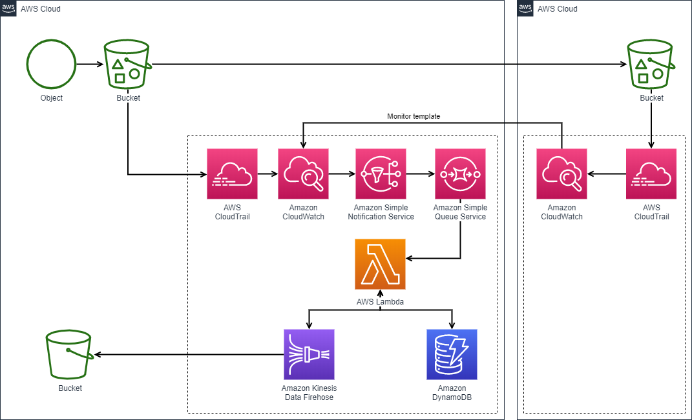

最高のプロダクト システム仕様書  
2020/08/30 大企業株式会社 Takenori Kusaka
=================================================

## 目次

1. [はじめに](#1.-はじめに)
    1. [概要](#1.1-概要)
    1. [対象](#1.2-対象)
    1. [関連資料](#1.3-関連資料)
    1. [用語](#1.4-用語)
1. [システム仕様](#2.-システム仕様)
    1. [外部アーキテクチャ](#2.1-外部アーキテクチャ)
    1. [内部アーキテクチャ](#2.2-内部アーキテクチャ)
    1. [インターフェース](#2.3-インターフェース)
    1. [主要実現技術](#2.4-主要実現技術)
1. [設計方針](#3-設計方針)

## 1. はじめに

これはQiita記事用に作ったサンプルです。

### 1.1 概要

めっちゃすんごいプロジェクトの概要です。

### 1.2 対象

"世界"

### 1.3 関連資料

| 文書番号 | 文章名 |
| ------ | ----------- |
| 000001 | 全世界が泣いた企画書 | 
| 000002 | 完成イメージがありありと浮かぶ要求仕様書 |
| 000003 | 完璧に実現可能な要求定義書 |

### 1.4 用語

| 用語 | 意味 |
| ------ | ----------- |
| 天才 | Takenori-Kusakaを指す | 
| バカ | Takenori-Kusakaのこと |
| 無能 | Takenori-Kusakaのような存在 |

## 2. システム仕様

こんなシステム、今までなかったって感じの仕様

### 2.1 外部アーキテクチャ

### 2.2 内部アーキテクチャ

Draw.ioのサンプルです。  

### 2.3 インターフェース

最新のプロトコル。きっと5Gとか使ってる。

### 2.4 主要実現技術

すべてを超越するAI

## 3. 設計方針

AIにまかせて人は手を動かさないこと
